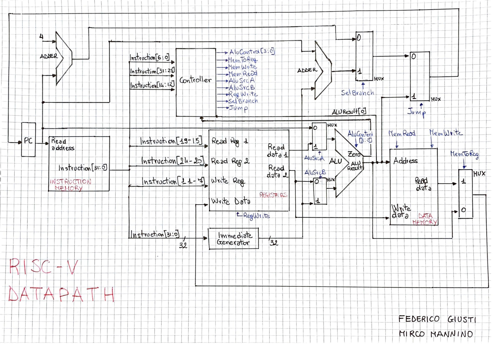

## RISC-V PROCESSOR IN VERILOG
The project is composed by all the modules that describe RISC-V processor, each of which contains the __Verilog file__, the __project file__ and a __snapshot of the timing diagram__ obtained.
The top level files, which test three simple programs, are:
* cpuRISCV-cpu_test
* cpuRISCV-cpu_factorial
* cpuRISCV-cpu_summation

---

### SCHEME

---

Below is a top-down description of the __RISC-V processor__.
### CPU
The CPU is the main module of the RISC-V processor, which coordinates all the sub-modules to ensure the operation of the entire system.

Module name | Description
--- | ----
`CORE` | Get the _Datapath_ and the _Controller_ to interact themselves
`INSTRUCTION MEMORY` |Holds the program's instructions
`DATA MEMORY` | Memory of the processor which holds the data

### CORE
Module name | Description
--- | ----
`CONTROLLER` | Component of the processor that commands the datapath and data-memory according to the instructions of the instruction-memory
`DATAPATH` |Components of the processor that perform arithmetic operations and holds data

### CONTROLLER
Module name | Description
--- | ----
`MAINDEC` | Main part of the controller. It runs the modules through control signals
`ALUDEC` |Generate the signal '_aluControl_' that drives the ALU

### DATAPATH
Module name | Description
--- | ----
`ALU` | Performs the arithmetic operation of the processor
`REGFILE` |Holds the 32 processor's registers
`IMMGENERATOR` | Manages the immediate subfields of the instructions
`FFD_RESETTABLE` |Implementation of the '_D - Edge Triggered_' used to increase the _Program Counter_ (PC)
`ADDER` | Makes the sum of two values (including when the second value is negative)
`MUX` |Implementation of a multiplexer with two 32bit input and 1bit control signal

__Project owners__
* Federico Giusti (https://github.com/Fede997)
*  Mirco Mannino  (https://github.com/MircoMannino)
